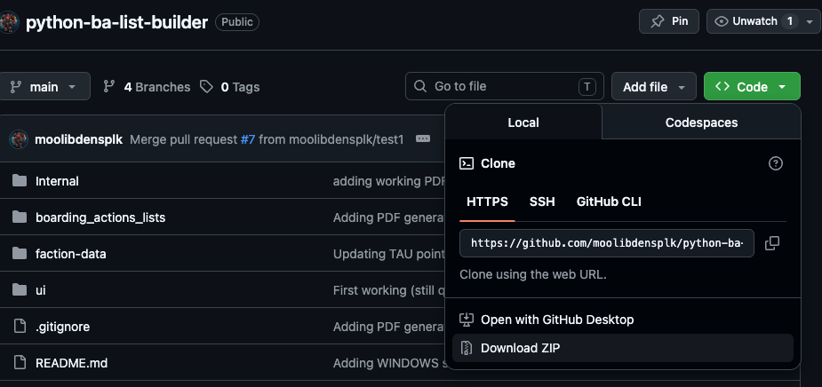
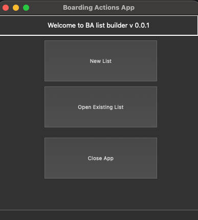

# Boarding Actions - List Building Helper

## Introduction
This python app is meant only to help sanitize your boarding patrol list building, by making sure, that your list complies with mustering rules defined for your faction / chosen detachment, in the official Boarding Actions Rules Book.
This App will NOT provide things like:
* weapons profiles
* stats
* descriptions of enhancements
* descriptions of stratagems

It only provides:
* names of available units to choose from (including leaders)
* their point cost
* names of leader enhancements 

It also Validates the following:
* no duplication happens (unless allowed in the mustering rules, like in case of battleline units like Tau Breachers !)
* no enhancement duplication for leaders
* total point cost fitting into the 500 points bracket

## Obtaining and Setup

### Requirements info
This app has been coded in Python 3.13.5, and as such this will be a minimum version of Python required to run it.
The setup instructions will also include things like:
* instructions how to download the code base
* instructions how to set up and use a python virtual environment (this is best practice, to install the app and its dependencies into a separate python virtual environment, to avoid messing up your Operating System's functionality, by not installing these modules directly in the python installation path used by the OS)
* instructions how to install the app itself and how to run it

* PyQT5: this app is not compatible with PyQT6. It has to use version 5!

Because it has been written in Python, it should run on all platforms:
* MacOS (this is the platform it was developed on)
* Linux
* Windows 

### Requirements - python modules
As per the `requiremetns.txt` file, the app requires the following python modules:
* PyQT5
* pyqt5-tools
* demjson3
* playwright  (this one is needed for handling the HTML to PDF conversion, when you use the SAVE button)

### Obtaining the code
In order to obtainthe copy of the app, just download the codebase from GITHUB.
For MacOS / Linux you can use `git` command line utility:

```
$ git clone https://github.com/moolibdensplk/python-ba-list-builder.git
```

If you are on Windows, then installation and configuration of git commandline tool is way beyond this tutorial, so you might want to just download the whole package as ZIP, using the URL:
https://github.com/moolibdensplk/python-ba-list-builder#
and clicking the `CODE` button, and then `Download ZIP` option:


### Create Python virtual environment
Once you downloaded the code using git, or using the `Download ZIP` option, enter the directory where you saved the code:
```
$ cd python-ba-list-builder
```

Then create a virtual environment called: `BA-venv`
```
$ python3 -m venv BA-venv
```
This will create a folder called: `Ba-venv` with an exact copy of your Python3 installation, allowing you to install any modules tools inside that virtual env, instead of your OS installed / default python3 path. Meaning - if you mess things up, you won't be messing up your operating system !

### Acitvate your virtual environment
All the steps following this one will include commandline a prompt showing the virtual environment's name.
This is to highlight that the given command HAS to be executed in the virtual environment

#### Virtual environment activation - MacOS / Linux
In MacOS / Linux / Unix systems, to activate the virtual environment, all you have to do is:

Assuming that you are already inside the `python-ba-list-builder` folder
```
$ source Ba-venv/bin/activate 
```
It will also change your os prompt to:
```
(BA-venv)$ ......
```
Showing that you currently

#### Virtual environment activation - Windows
On Windows systems, there is no `source` command, and instead you will most likely have a `.bat` script inside the `bin` subfodler in the `BA-venv` folder, for example: `activate.bat`
Just execute that from the command line, and it should activate your virtual environment, changing the command line prompt just like above, in case of Linux/Unix systems.

```
$ python-ba-list-builder\bin\activate.bat
```

### Install Dependencies
In order to install all the required modules, you  must make sure that you are in your virtual environment (check the prompt !)
```
(BA-venv)$ 
```
Then run the pip utility (should be installed together with Python !)

```
(BA-venv)$ pip install -U pip
(BA-venv)$ pip install -r requirements.txt
(BA-venv)$ playwright install
```

### Run the app
Once all the required python libraries have been installed using pip, you are ready to execute the `main.py` file, which will start the app.
Once the app started, you will have a little window pop, showing 3 options:
* creation of a new list
* opening of a previously saved list (NOT SUPPORTED atm)
* closing the app



  
Choose the option to create a list, and go from there:
* choose your faction
* choose one of the detachments available for that faction
* then choose your leaders, units etc.
* Once you are happy with the list, you can click the save button, which will allow you to save the list as a PDF file.

#### IMPORTANT - limited factions / detachments supported
Due to this being a hobby / spare time kind of project, there are only two factions supported at the moment, with two detachments available for each faction:
* Tau Empire
  * Starfire Cadre
  * Kroot Riding Party
* Chaos Daemons
  * Pandemonic Inferno
  * Rotten and Rusted

There might be more added in the future, but I might need to wait until 11th Edition launches, to avoid having to do updates twice.

PS. you are more than welcome to FORK this code and make changes on your own, without waiting for me to implement things.